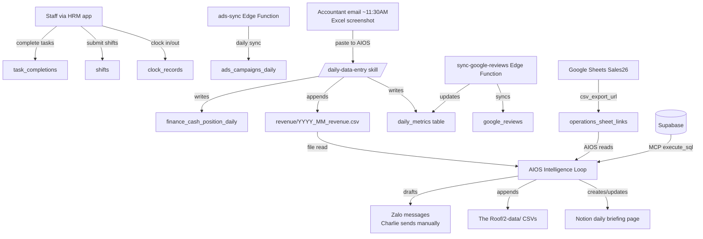

# System Architecture — HRM × AIOS

*Last updated: 2026-04-22 | Project: The Roof Da Nang*

---

## Overview

Two systems, one goal: give Charlie real-time visibility into The Roof without manual data wrangling.

- **HRM** (`the-roof-hrm.vercel.app`) — staff-facing operational platform. Manages shifts, tasks, announcements, clock-in/out, reservations. The **write path** for all operational data.
- **AIOS** (Claude Code CLI, local Mac) — the intelligence layer. Reads from HRM + Supabase + Google Sheets + CSV files, runs analysis, surfaces daily/weekly/monthly insights. The **read + analyze path**.

---

## System Layers

```
┌─────────────────────────────────────────────┐
│  STAFF / MANAGERS                           │
│  HRM App (the-roof-hrm.vercel.app)          │  ← Vercel frontend
└────────────────────┬────────────────────────┘
                     │ writes
┌────────────────────▼────────────────────────┐
│  SUPABASE BACKEND                           │
│  gewlgslgltrhnwrsttsm.supabase.co           │  ← Postgres + Storage + Edge Functions
│  77 tables · 10 Edge Functions              │
└──────┬─────────────────────────┬────────────┘
       │ reads (MCP)             │ syncs
┌──────▼──────────┐   ┌──────────▼───────────┐
│  AIOS (local)   │   │  GOOGLE SHEETS        │
│  Claude Code    │   │  Sales26 spreadsheet  │
│  21 skills      │◄──┤  Sales/PnL/Salary/Cal │
│  Rules engine   │   └──────────────────────┘
│  Memory folder  │
└──────┬──────────┘
       │ writes
┌──────▼──────────────────────────────────────┐
│  CSV LAYER + NOTION                         │
│  The Roof/2-data/ + Daily briefing pages    │
└─────────────────────────────────────────────┘
```

---

## Component Inventory

### Frontend
- **URL:** `https://the-roof-hrm.vercel.app`
- **Platform:** Vercel
- **Role:** Write path only. Staff use this to clock in/out, submit tasks, view schedules, send announcements.

### Supabase Backend
- **Project URL:** `https://gewlgslgltrhnwrsttsm.supabase.co`
- **Tables:** 77 (public schema)
- **Storage:** Source file uploads (accountant screenshots, social reports, HR docs)
- **Auth:** Supabase Auth + Google OAuth via Edge Functions

### Edge Functions (10 active)

| Slug | Version | JWT | Purpose |
|------|---------|-----|---------|
| `bright-service` | v92 | No | Main service handler — core business logic |
| `google-auth` | v17 | No | Google OAuth initiation |
| `google-auth-callback` | v23 | No | Google OAuth callback + token exchange |
| `sync-google-reviews` | v17 | No | Pulls Google Business reviews → DB |
| `create-employee` | v20 | No | New employee onboarding flow |
| `dashboard-summary` | v8 | Yes | Aggregated dashboard data for HRM UI |
| `super-handler` | v7 | Yes | General-purpose request router |
| `reservation-reminders` | v8 | Yes | Automated reservation reminder push/Zalo |
| `send-push` | v11 | No | Push notification dispatcher |
| `ads-sync` | v3 | No | Syncs Google Ads data → `ads_campaigns_daily` |

### CSV Layer
**Location:** `The Roof/2-data/`

| File pattern | Content | Status |
|---|---|---|
| `revenue/YYYY_MM_revenue.csv` | Daily revenue by category | ✅ Live |
| `cashflow/YYYY_MM_cashflow.csv` | Daily cash balance | ✅ Live |
| `pnl/YYYY_MM_pnl.csv` | Monthly P&L | ✅ Via GSheets |
| `google-business/2026_google_business.csv` | Google reviews + GMB stats | ✅ Minimal |
| `google-ads/YYYY_MM_google_ads.csv` | Ads performance | ✅ Minimal |
| `inventory/YYYY_MM_inventory.csv` | Weekly stock counts | 🟡 Backfill |
| `events/event_performance.csv` | Event ROI data | 🟡 Empty |
| `partners/partners.csv` | Partner pipeline | 🟡 Empty |
| `hrm/YYYY_MM_hrm.csv` | HR efficiency snapshots | 🟡 Empty |

### Google Sheets
- **Spreadsheet ID:** `1xAWccI666vfcoUWpMzQyrlQ-sZ4ggkPS7oNwfIx71iw`
- **Tabs used by AIOS:** Sales (daily revenue + pax), PnL 2026 (monthly budget vs actual), Calendar (events), Salary (staff pay rates)
- **Access method:** CSV export URLs stored in `operations_sheet_links` Supabase table (currently empty — see gaps below)

### AIOS (Local)
- **Runtime:** Claude Code CLI, Charlie's Mac (ICT UTC+7)
- **Skills:** 21 skills in `.claude/skills/`
- **Intelligence:** Rules engine in `The Roof/3-intelligence/rules.md`
- **Memory:** Persistent memory folder at `.claude/projects/.../memory/`
- **Schedules:** Cron jobs (morning briefing 9:30AM, revenue 12:30PM, EOD midnight, weekly Sunday 9AM)

---

## Source of Truth Mapping

| Data type | Source of truth | Fallback | Notes |
|---|---|---|---|
| Staff roster + roles | `profiles` table | `org_chart.md` | |
| Daily revenue + pax | `daily_metrics` table | Sales26 Google Sheet | |
| Monthly P&L | `pnl_monthly` table | Google Sheet PnL tab | |
| Cash position (bank) | `finance_cash_position_daily` | `cashflow/` CSVs | cash_balance_vnd often 0 — see gaps |
| Supplier debt | `finance_supplier_debt_weekly` | Thu's Zalo payment schedule | **0 rows — not yet active** |
| Shifts + attendance | `shifts` + `clock_records` | HRM frontend | geofence data unreliable |
| Staff pay rates | `employee_pay_details` | `org_chart.md` | |
| Social media metrics | `marketing_social_monthly_reports` | Nhi's screenshots | 2 rows live (Mar + Apr 2026) |
| Ads performance | `ads_campaigns_daily` | `google-ads/` CSVs | 20 rows live, ads paused Apr 13 |
| Events calendar | `events` table | Google Sheet Calendar tab | 82 rows |
| Google Sheet URLs | `operations_sheet_links` | CLAUDE.md hardcodes | **0 rows — blocker** |

---

## Data Flow Diagram



---

## Current Gaps

These are known issues that reduce AIOS reliability. Fix in order of impact.

### Critical (blocking AIOS automation)
- **`operations_sheet_links` has 0 rows.** AIOS cannot auto-read Google Sheets until `kind`, `sheet_url`, and `csv_export_url` are populated for: `sales`, `pnl`, `salary`, `calendar`. Action: Charlie or developer inserts 4 rows.

### High (reducing data quality)
- **`finance_cash_position_daily.cash_balance_vnd` = 0 on all rows.** Only bank balance is being entered. Cash-on-hand is not tracked. Action: Thu to include physical cash in daily entry.
- **`finance_supplier_debt_weekly` has 0 rows.** AIOS cannot check payment obligations or runway. Action: Thu to begin weekly Friday entry.

### Medium (known data quirks — work around, fix later)
- **`clock_records.is_within_geofence` unreliable.** GPS drift reported up to 5km. Do not use for attendance KPI calculations.
- **`shifts` table has legacy duplication:** `staff_id` and `employee_id` columns both reference the employee; `shift_date` and `date` both store the date. Use `employee_id` and `date` for new queries.
- **`daily_metrics.labor_cost`, `.staff_on_duty`, `.hours_worked` are zero-filled.** Use `pnl_monthly.labor_cost` for HR cost ratio calculations.
- **`task_completions.completed_tasks` is mostly empty arrays.** Low staff adoption. Do not use for performance KPIs yet.

### Low (backfill when convenient)
- `events/event_performance.csv` — empty, needs Jan–Apr 2026 backfill
- `partners/partners.csv` — empty, needs active partner list
- `hrm/YYYY_MM_hrm.csv` — empty, `/hrm-revenue-snapshot` skill needs this populated
