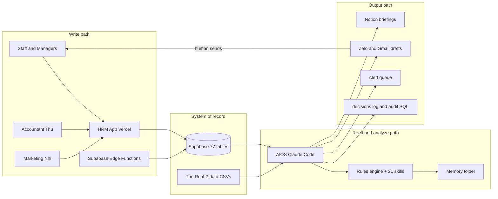

# AIOS-HRM Automation Blueprint

*Last updated: 2026-04-22 | Companion to the rest of `Docs/aios/`.*

---

## Purpose

This is the "how these two systems work together" doc. It is intentionally opinionated and conservative: humans keep approval over money, HR changes, and any staff-facing message. Everything else becomes automation.

Read this after `README.md` and `system-architecture.md`. Read it before writing any new automation.

Related:

- [system-architecture.md](system-architecture.md)
- [aios-capabilities.md](aios-capabilities.md)
- [access-and-security.md](access-and-security.md)
- [integration-map.md](integration-map.md)
- [automation-playbooks.md](automation-playbooks.md)
- [kpi-definitions.md](kpi-definitions.md)
- [alerts-and-escalation.md](alerts-and-escalation.md)
- [runbook.md](runbook.md)
- [implementation-roadmap.md](implementation-roadmap.md)
- [data-contracts.md](data-contracts.md)

---

## 1. One-line operating model

**HRM is the write path. AIOS is the read, analyze, draft, and alert path. Humans approve money, HR, and staff-facing communication.**

If you are ever unsure whether AIOS should do something, run it through that sentence first.

---

## 2. Automation tiers

Every action AIOS might take falls into one of three tiers. This is the rule set that governs new automation:

| Tier | Who decides | Examples |
|---|---|---|
| Green (auto) | AIOS acts without asking | Read tables, aggregate KPIs, update CSVs in `The Roof/2-data/`, update Notion drafts, write to `memory/`, append to `decisions/log.md`, detect anomalies |
| Yellow (draft only) | AIOS drafts, human reviews and sends | Zalo drafts (Thuy / Phu / Thu / Nhi / Anh Tu), Gmail drafts, bonus pool numbers, supplier payment priority, contract reminders |
| Red (blocked) | Hard stop, no override | Payments, salary changes, staff-facing sends, writes to `profiles` / `employee_pay_details` / `employee_banking` / `hr_documents`, production deletes |

Source of truth for Red constraints: [access-and-security.md](access-and-security.md).

---

## 3. Target architecture

Key invariants:

- There is exactly one write path into Supabase: HRM (UI) or Edge Functions. AIOS never writes to `profiles`, `employee_pay_details`, `employee_banking`, or `hr_documents`.
- There is exactly one system of record: Supabase + the `The Roof/2-data/` CSV mirror. Everything else (Notion, Zalo drafts, briefings) is a derivative.
- Drafts never become sends without a human.

---

## 4. What is good today

Validated against `system-architecture.md`, `integration-map.md`, `kpi-definitions.md`, `access-and-security.md`, and `implementation-roadmap.md`.

- Clean separation of concerns: HRM writes, AIOS reads.
- Supabase is a single backend source of truth with clear table ownership per domain.
- 21 skills already built and tested against live data.
- KPI dictionary is canonical, with formulas, owners, thresholds, and reliability scores.
- Alert severity model has routing and concrete message templates.
- Security model has explicit free / approval / never-write scopes, plus classification levels.
- Day-1 connectivity and data-freshness checklist is defined and repeatable.
- Data contracts exist for the four most important integration tables (`finance_cash_position_daily`, `finance_supplier_debt_weekly`, `operations_sheet_links`, `marketing_social_monthly_reports`).
- Playbooks cover the three real loops: daily revenue, Friday close, monthly reporting.
- CSV fallback layer is real, not theoretical; AIOS keeps working if Supabase MCP is down.

---

## 5. What is bad today

From [implementation-roadmap.md](implementation-roadmap.md) and [data-contracts.md](data-contracts.md), plus observed drift:

- Google Sheets auto-read is blocked because `operations_sheet_links` has 0 rows.
- `finance_cash_position_daily.cash_balance_vnd` is always 0; cash KPI is understated.
- `finance_supplier_debt_weekly` has 0 rows; cash runway and payment priority are incomplete.
- Daily revenue flow still depends on Charlie pasting an accountant screenshot into AIOS chat.
- Social monthly reports depend on a manual Nhi upload with no schedule enforcement.
- `ads-sync` and `sync-google-reviews` cron cadences are undocumented.
- `clock_records.is_within_geofence` is unreliable; cannot be used for attendance KPIs.
- `daily_metrics.labor_cost`, `staff_on_duty`, `hours_worked` are zero-filled and misleading; use `pnl_monthly.labor_cost` for HR cost ratio.
- `task_completions` has low adoption; cannot be used for performance KPIs.
- Schema duplication in `shifts` (`staff_id`/`employee_id`, `shift_date`/`date`).
- AIOS has no persistent in-session state; a session crash means the skill restarts from scratch.
- No automated schema-drift detection yet; the `employee_leave_summary` view was found in Supabase but not in repo migrations, which confirms drift risk.
- No shared "automation status" surface inside HRM; managers cannot see what AIOS is doing or waiting on.

---

## 6. Design principles

These govern any new automation added on top of the current system.

1. **Inputs out of chat.** Push data entry into HRM forms or Edge Functions. Chat is a fallback.
2. **Source tagging.** Every AIOS-written row records who or what triggered it, so audits are trivial.
3. **Drafts, not sends.** AIOS never messages staff. It produces drafts that Charlie or a manager sends.
4. **No hardcoded sheet URLs.** All Google Sheets reads go through `operations_sheet_links`.
5. **One threshold source.** Thresholds live in `The Roof/3-intelligence/rules.md` and [kpi-definitions.md](kpi-definitions.md). Skills read them, never hardcode them.
6. **Every automation has a manual mode.** See [runbook.md](runbook.md). Charlie can flip any playbook to manual at any time.
7. **Drift is observed.** A weekly schema-and-grants audit (see `supabase/security/rls_audit.sql`) runs and surfaces its result in the morning brief.
8. **Capabilities verify themselves.** The monthly capability verification checklist runs on a schedule and writes pass/fail to `memory/`.
9. **Fail closed.** When in doubt, AIOS withholds and asks Charlie. Never invents data, never sends to staff without approval, never writes to Red-tier tables.

---

## 7. Target workflows

What the system should look like once Phase 1 and Phase 2 are done.

### 7.1 Daily revenue

- Thu submits revenue + bank balance + cash drawer count via an HRM form (or an Edge Function parses her daily email).
- Edge Function writes `daily_metrics` + `finance_cash_position_daily`.
- AIOS detects the new rows, runs the intelligence loop, updates the Notion daily brief, and surfaces any alert.
- No chat paste required.

### 7.2 Weekly supplier debt

- HRM exposes a simple Friday form for Thu: total debt, overdue amount, notes.
- Writes to `finance_supplier_debt_weekly`.
- `/expense-dashboard` and the weekly close read from it automatically.

### 7.3 Monthly social report

- Nhi uploads the monthly screenshot via HRM.
- Edge Function stores the file, then queues a parse job for AIOS.
- AIOS parses the image into `marketing_social_monthly_reports.payload` and flags any inconsistency (for example review count going down month over month).

### 7.4 Cash and runway

- AIOS computes runway nightly against documented fixed costs.
- Cash RED (see [alerts-and-escalation.md](alerts-and-escalation.md)) auto-drafts a Zalo to Charlie and Thu; nothing is sent.

### 7.5 Bonus calculation

- At month close, AIOS runs the bonus calc automatically using `pnl_monthly.gross_sales` and the Google Review Gate.
- Charlie approves in chat; only then do numbers appear in any output intended for staff.

### 7.6 Staff follow-up

- AIOS drafts Zalo messages per manager (Thuy, Phu, Thu, Nhi, Anh Tu) based on `delegation_tasks`, unsigned contracts in `profiles`, and weekly KPIs.
- Charlie or the manager forwards.

---

## 8. Execution plan

Sequenced, and tied to the existing phase gates in [implementation-roadmap.md](implementation-roadmap.md). Do not skip ahead.

### Phase 1 — Data foundation (now to 30 days)

1. Populate `operations_sheet_links` with 4 rows (`sales`, `pnl`, `salary`, `calendar`).
2. Fix the daily cash entry process with Thu so `cash_balance_vnd` is no longer 0.
3. Start weekly `finance_supplier_debt_weekly` rows (Friday cadence).
4. Confirm and document cron schedules for `ads-sync` and `sync-google-reviews`.
5. Correct the March 2026 `marketing_social_monthly_reports` Google review inconsistency.
6. Run the Supabase RLS audit (`supabase/security/rls_audit.sql`) and close remaining findings.

Gate to exit Phase 1: all 6 above complete and the Day-1 connectivity checklist from [runbook.md](runbook.md) is green.

### Phase 2 — Remove manual intake (30 to 60 days)

1. HRM forms: daily revenue + cash entry, weekly supplier debt, monthly social upload.
2. Replace all hardcoded Google Sheets URLs in skills with `operations_sheet_links` lookups.
3. AIOS trigger pattern: when `daily_metrics` row inserts, fire the daily intelligence skill (no chat paste).
4. Weekly schema-drift audit script wired into the Monday morning brief.

Gate to exit Phase 2: daily brief runs for 14 consecutive days with zero chat-paste interventions.

### Phase 3 — Proactive and self-healing (60 to 90 days)

1. Cash RED, 3-day revenue red streak, ads budget depletion, and review-pace alerts all auto-draft Zalo messages in the morning brief.
2. Bonus calculation fully automated; Charlie only approves.
3. Capability verification checklist runs on a schedule; failures surface next morning.
4. Read-only "Automation status" panel inside HRM for Charlie and managers (last run times, pending drafts, open alerts).

Gate to exit Phase 3: two consecutive weeks with zero false-positive critical alerts and a fully automated monthly report (only Charlie's four qualitative answers required).

### Phase 4 — Hardening (ongoing)

1. Quarterly review checklist applied before each new quarter (targets, priorities, thresholds, org chart).
2. Every high-impact decision logged in `decisions/log.md`.
3. CSV layer always kept functional as the disaster fallback.

---

## 9. Success metrics

The system is working well when all of these hold for four consecutive weeks:

- Daily brief runs with zero chat-paste interventions.
- Weekly close generates with no missing data sections.
- Monthly report runs with only Charlie's four qualitative answers.
- Zero false-positive critical alerts.
- No `INSERT` / `UPDATE` on `profiles`, `employee_pay_details`, `employee_banking`, or `hr_documents` from AIOS.
- `operations_sheet_links` URLs return 200 on every weekly check.
- Audit SQL shows expected RLS state with no drift.

---

## 10. Risks and how we handle them

- **Staff data-entry drift (Thu, Nhi).** Enforce with HRM reminders + weekly check in the brief.
- **Google Sheets OAuth expiry.** Captured by monthly capability check; re-auth via the `google-auth` Edge Function.
- **Supabase schema drift from SQL editor.** Captured by the weekly audit script; surfaced in the morning brief.
- **Bonus error leaking to staff.** Hard block; Charlie approves every time; covered by [access-and-security.md](access-and-security.md).
- **Session crash mid-playbook.** Skills are idempotent and do duplicate-date checks on every write.
- **Cash below 100M VND.** Automation drops into manual mode automatically (see [runbook.md](runbook.md)).
- **Automation working alone while Charlie is unavailable.** Green-tier loops continue; Yellow drafts queue up; no staff-facing outputs are sent without Charlie.

---

## 11. How to use this doc day to day

- When proposing a new automation, classify it (Green / Yellow / Red) before building it. If it is Red, stop.
- When something breaks, start with [runbook.md](runbook.md). This blueprint tells you what should be true; the runbook tells you how to get back to it.
- When a KPI threshold changes, update [kpi-definitions.md](kpi-definitions.md) and `The Roof/3-intelligence/rules.md`, not a skill file.
- When the architecture changes (new table, new Edge Function, new integration), update the mermaid diagram in Section 3 of this doc.
